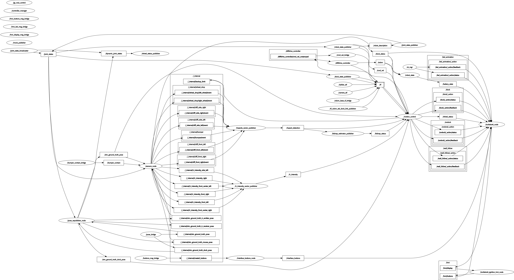

1. 环境配置
```bash
#因为上一阶段的环境总结没有详细记录，这里重新总结一下
rosdock #开启ros的docker,但实际上不怎么使用，而是使用espidf的环境进行编译等
redocker    #开启ros和espidf的docker
idf5.1      #主机激活espidf环境
rosdev      #主机激活ros环境
mragent     #激活客户端ros的docker
rosb        #激活rosbridge的docker
```
```bash
#激活ros环境
rosdev
#放置指定机器人到指定world
#起始指令有更新
ros2gpu launch turtlebot4_ignition_bringup turtlebot4_ignition.launch.py \
world:=/home/shrinkraln/codes/gazebo_models/world0/world0.1
rviz:=true 
```
2. 问题及解决
   1. 有进入之后画面黑暗：sdf文件使用的是在线脚本上色，解析不稳，改为直接配置颜色
```xml
//删除
<material>
  <script>
    <uri>file://media/materials/scripts/gazebo.material</uri>
    <name>Gazebo/Grey</name>
  </script>
  <ambient>1 1 1 1</ambient>
</material>
//使用
<material>
  <ambient>0.7 0.7 0.7 1</ambient>
  <diffuse>0.7 0.7 0.7 1</diffuse>
  <specular>0.1 0.1 0.1 1</specular>
</material>
```
   2. gui崩溃：删除state块
```xml
<state world_name='default'>
...
</state>
```
   3. 指定的文件是SDF即可，world在新版合并；指定文件不需要添加.sdf后缀
   4. 雷达被遮挡：强制cpu启动（但是会有明显卡顿）
   5. 使用GPU解决卡顿
```bash
#添加到系统环境文件
alias gazebogpu='__NV_PRIME_RENDER_OFFLOAD=1 __GLX_VENDOR_LIBRARY_NAME=nvidia ign gazebo'
alias ros2gpu='__NV_PRIME_RENDER_OFFLOAD=1 __GLX_VENDOR_LIBRARY_NAME=nvidia ros2'
```
   6. echo /scan不能接受,同时因为rvize2监听的也是/scan,同样需要打通才能看到雷达
```bash
#在另一终端手动打通
ros2 run ros_gz_bridge parameter_bridge /world/default/model/turtlebot4/link/rplidar_link/sensor/rplidar/scan@sensor_msgs/msg/LaserScan[ignition.msgs.LaserScan --ros-args -r /world/default/model/turtlebot4/link/rplidar_link/sensor/rplidar/scan:=/scan
```
   7. 在rviz2中要fix 选择odom才是底座相机固定
   8. 对于/scan有生成新的topic消息流
